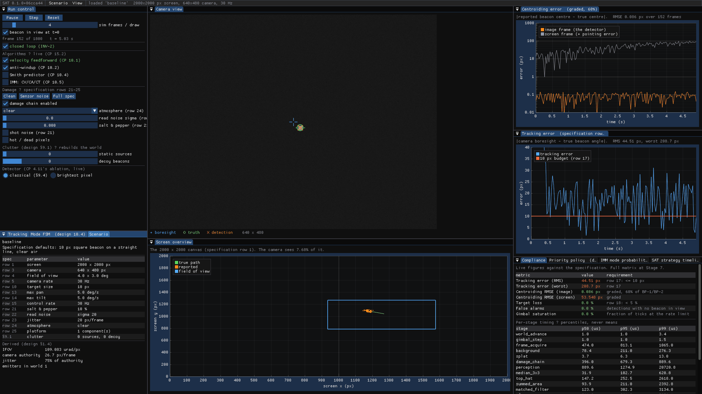

# QUICKSTART

Five minutes from a clean checkout to a tracked beacon.

> Want the longer version, with screenshots and an explanation of every panel?
> [`docs/GUIDE.md`](docs/GUIDE.md) is the guided tour. This page is the sprint.

## 1. Build

```bash
just build
```

That is the whole dependency story for the core system: CMake ≥ 3.20 and a
C++20 compiler. Eigen, toml++, nlohmann/json and doctest are fetched
automatically if the system does not have them.

Two things are **optional** and the build says so if they are missing:

| Missing | What stops working |
|---|---|
| OpenCV | MP4 ingest (`--video`), and the kernel tests' oracles |
| GLFW | the live dashboard (`just gui`) |

```bash
just info          # prints exactly what was found and what was fetched
```

## 2. Prove it works on this machine

```bash
just gates         # static invariant checks, a few seconds
just test          # the full suite
just gate-video    # ★ can this build decode MP4 at all
```

`gate-video` matters more than it looks: 30 % of the marks depend on video
ingest, and a machine that cannot decode MP4 should find that out in the first
five minutes rather than the last five.

## 3. Run something

```bash
just gui                                    # the live dashboard
just headless "--scenario scenarios/baseline.toml --duration 20"
just video tests/video/clips/screen_2000x2000_30fps.mp4
```



Each headless run writes to `logs/run/`:

| File | What it is |
|---|---|
| `centroid.csv` | one row per frame, design §13.2's format — **the graded artifact** |
| `run.json` | every metric, the full scenario echoed back, and the reproducibility fingerprint |
| `report.html` | the same, rendered, self-contained, with inline plots |

## 4. Read the numbers

Three things in the output are easy to misread, and each is labelled in place:

- **Two centroiding errors.** Image-frame is the detector alone. Screen-frame
  additionally carries the pointing error, which the detector cannot influence.
  They are different quantities and INV-6 keeps them apart.
- **Two acquisition times.** *Cold* starts at the run; *in view* starts when the
  beacon enters the field. The specification asks for 2 s and the geometry
  gives 18.7 s for a cold search — `docs/RESULTS.md` §1 derives it.
- **Tracking error against its floor.** Specification row 23's jitter puts a
  16.33 px RMS floor under any controller.

## Where to go next

| | |
|---|---|
| **the guided tour, with screenshots** | [`docs/GUIDE.md`](docs/GUIDE.md) |
| what it is and how it is built | [`docs/ARCHITECTURE.md`](docs/ARCHITECTURE.md) |
| every measured number, with the command that reproduces it | [`docs/RESULTS.md`](docs/RESULTS.md) |
| every command and every scenario key | [`docs/MANUAL.md`](docs/MANUAL.md) |
| what each metric means and why | [`docs/METRICS.md`](docs/METRICS.md) |
| the ten-minute demo, minute by minute | [`docs/DEMO.md`](docs/DEMO.md) |
| what is still wrong with it | [`issues_till_now.md`](issues_till_now.md) |

```bash
just --list        # every command, with what it is for
```
