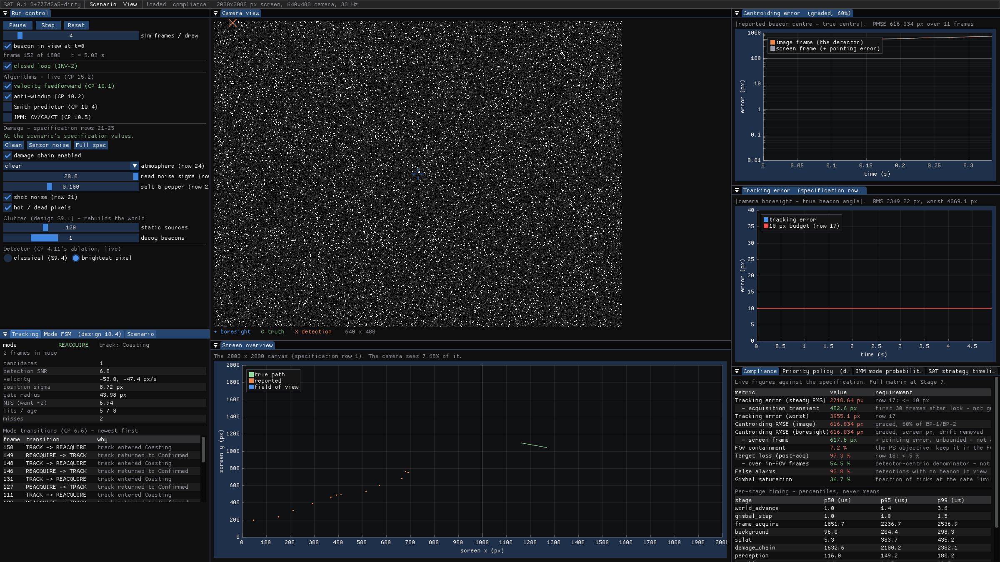
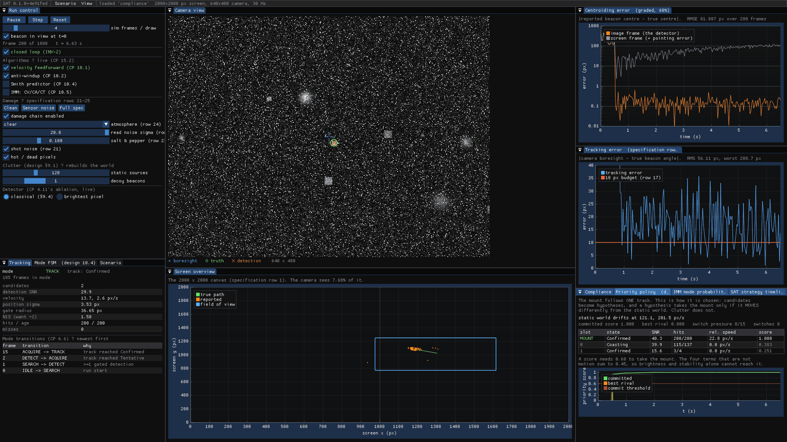
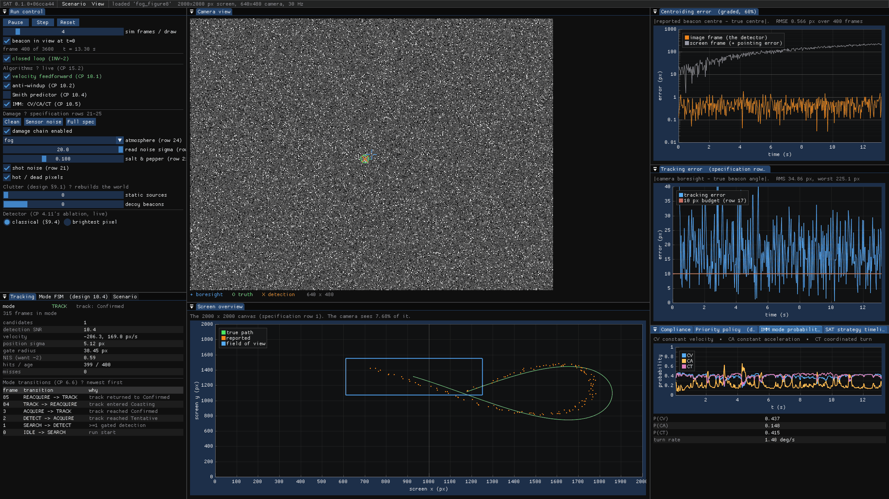
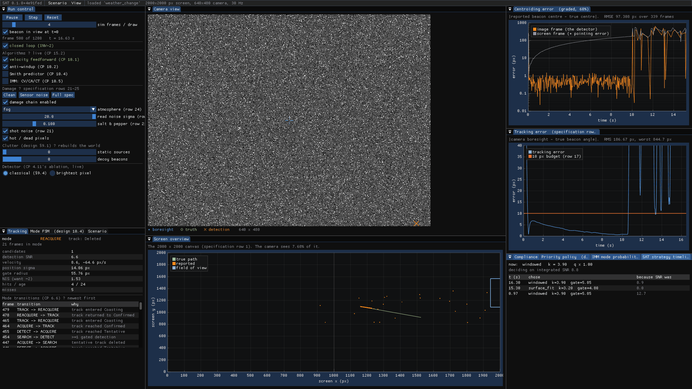
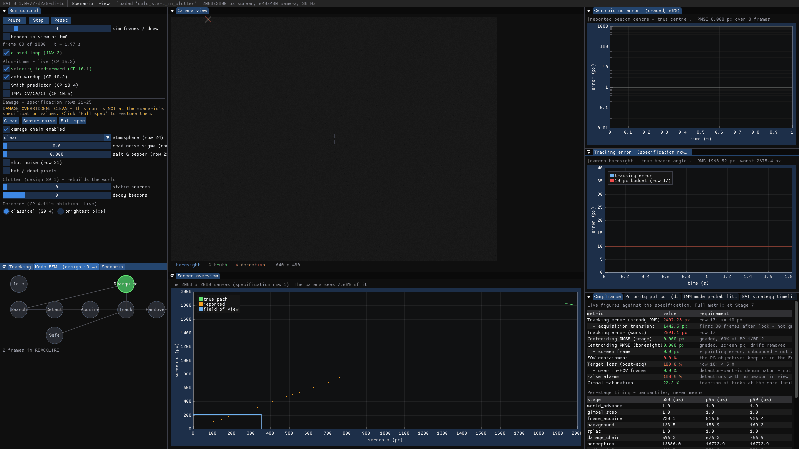

# SAT — a guided tour

*How to actually use this thing.* Fifteen minutes, start to finish.

For the complete command reference see [`MANUAL.md`](MANUAL.md); for what every
number means see [`METRICS.md`](METRICS.md); for what the measurements say see
[`RESULTS.md`](RESULTS.md). This page is the tour.

---

## What the product is

A pan–tilt camera is pointed at a 2000 × 2000 pixel screen. Somewhere on that
screen is a beacon — a bright spot 5 to 20 pixels across. The camera sees
640 × 480 of the screen at a time, which is **7.68 % of it**.

SAT's job is to find the beacon, report where its centre is to a fraction of a
pixel, and keep the camera pointed at it — through fog, sensor noise, a
platform that drifts, and camera shake of up to ±20 pixels every frame.

It ships as **one binary**, `sat-tracker`, which does everything:

| You want to | Run |
|---|---|
| watch it work | `sat-tracker --gui` |
| score one run | `sat-tracker --headless --scenario FILE` |
| track a supplied MP4 | `sat-tracker --video clip.mp4 --out logs/` |
| score 200 runs at once | `sat-tracker --sweep scenarios/sweeps/weather.toml` |
| see where the time goes | `sat-tracker --headless --stages` |

Every one of those is also a `just` recipe. `just --list` shows all of them.

---

## 1. Build it

```bash
just build
```

CMake ≥ 3.20 and a C++20 compiler is the whole hard requirement. Eigen, toml++,
nlohmann/json and doctest are fetched if your system does not have them.

Two things are optional, and the build tells you if they are missing:

| Missing | What stops working |
|---|---|
| **OpenCV** | MP4 ingest (`--video`), the kernel tests' oracles, and `--gui --shot` |
| **GLFW** | the dashboard |

```bash
just info      # exactly what was found and what was fetched
just test      # 20 suites; about 80 seconds
```

---

## 2. Open the dashboard

```bash
just gui
```


Five things to look at, in the order they matter.

**Camera view** (centre top) is what the tracker sees — the actual 640 × 480
frame, after the atmosphere, the shot noise, the read noise, the fixed pattern
and the impulse noise. Three overlays: `+` where the camera is pointing, `O`
where the beacon truly is, `X` where the detector says it is. When the system is
working, all three sit on top of each other.

**Centroiding error** (top right) is **60 % of the marks.** Two traces, and
keeping them apart is invariant INV-6:

* *image frame* — the detector alone. How far the reported centre is from the
  true centre, in the camera's own pixels. On a clean frame this reads about
  **0.14 px**.
* *screen frame* — the same thing plus the pointing error, which the detector
  cannot influence. It is always larger and it is not a measure of the
  detector.

**Tracking error** (right) is how far the camera is pointing from the beacon —
a measure of the control loop, not of the detector. The red line is
specification row 17's 10 px budget. On the default scenario it is **exceeded**,
and that is not a defect: row 23 puts ±20 px of jitter on the boresight every
frame, which puts a 16.33 px floor under this number before anything else
happens. The derivation is in [`RESULTS.md`](RESULTS.md).

**Screen overview** (centre bottom) is the whole 2000 × 2000 canvas with the
camera's field of view drawn on it, so you can see how little of the world the
camera actually sees.

**Run control** (left) is where you break things. Everything in it takes effect
immediately, on a running simulation.

---

## 3. Break it on purpose

This is the fastest way to understand what the system is for.

### Turn the damage up

`Clean` → `Sensor noise` → `Full spec` steps through the specification's
degradation. At **Full spec** you get row 21's 10 % salt-and-pepper (30,720
corrupted pixels against a 100-pixel beacon, every one of them brighter), row
22's read noise at σ = 20 grey levels, shot noise, and 40 stuck pixels.

Watch the camera view fill with snow and the centroiding trace stay flat.

### Switch the detector

The **Detector** radio buttons switch between the real pipeline (§9.4: a 3×3
median, a van Herk top-hat, integer summed-area tables, a multi-scale matched
filter, CFAR with a guard band, run-length grouping, a shape gate and an SNR
gate) and a deliberate straw man that just takes the brightest pixel.

With the damage at Full spec, switch to **brightest pixel** and watch the lock
fail within a few frames. That comparison is checkpoint 4.11, and it is the
measured justification for every kernel in the detector.



That figure is the ablation itself. It is the **same scenario, same seed, same
damage and the same 120 clutter sources** as the priority-policy figure further
down — `just screenshots` generates the two from identical command lines except
for `--shot-strawman`. Only the detector differs, and the compliance table
reads:

| | classical (§9.4) | brightest pixel |
|---|---:|---:|
| tracking error, RMS | 63.7 px | **2,349 px** |
| tracking error, worst | 208.7 px | **4,068.9 px** |
| centroiding RMSE | 92.9 px | **616.0 px** |
| false alarms | 0.0 % | **92.8 %** |
| gimbal saturation | 5.1 % | **36.7 %** |

Read the rest of the window and you can watch the failure happen. The mode
transition list is thrashing `TRACK → REACQUIRE → TRACK` every two or three
frames. The track is `Coasting` with 5 hits against 8 frames of age. And the
screen overview shows the reported trail wandering off along a diagonal while
the true path sits, untouched, on the other side of the canvas — the mount is
chasing salt-and-pepper noise, and it is chasing it at a third of its rate
limit.

### Turn the feedforward off

Under **Algorithms · live**, untick `velocity feedforward`. The tracking error
trace jumps by a factor of four and the camera visibly trails the beacon.
Tick it back on. That is checkpoint 10.1, and it is the most legible thirty
seconds in the whole demo.

---

## 4. The panels that explain the tracker

Four panels answer the question "why did it do that". They share a tab bar at
the bottom right; click through them.

### Priority policy — how the mount chooses what to follow



This is the single most consequential decision the tracker makes, and before
this panel existed it was invisible.

The specification puts **120 static clutter sources** on the screen and
deliberately makes about half of them brighter than the beacon. Taking the
brightest candidate — which is what the tracker used to do — picks a rock on
almost every run.

So candidates become **hypotheses**, and a hypothesis takes the mount only if it
*moves differently from the static world*. In the screenshot:

| slot | state | SNR | hits | rel. speed | score |
|---|---|---|---|---|---|
| **MOUNT** | Confirmed | 40.3 | 200/200 | **22.8 px/s** | **1.000** |
| 0 | Coasting | 39.9 | 115/137 | 0.0 px/s | 0.383 |
| 1 | Confirmed | 15.6 | 3/4 | 0.0 px/s | 0.251 |

Slot 0 is a clutter source almost exactly as bright as the beacon — SNR 39.9
against 40.3 — and it scores 0.383 against 1.000, because it is not going
anywhere. A score has to reach 0.60 to take the mount, and the four terms that
are *not* motion sum to 0.45, so **brightness and stability alone cannot reach
the threshold however bright and however stable.**

The line above the table — *"static world drifts at …"* — is the tracker's own
estimate of specification row 25's platform motion, recovered from the median of
what all the live tracks are doing. It has to be: the tracker converts pixels to
angles through the *commanded* boresight, so a static source *appears* to move at
minus the platform rate, and without subtracting that the motion term picks the
rock. The full argument is in `docs/SAT-DESIGN.md` §14.0c.

### IMM mode probabilities — which motion model is winning



Load `scenarios/fog_figure8.toml`, tick **IMM: CV/CA/CT**, and watch. Three
models run in parallel — constant velocity, constant acceleration, coordinated
turn — and the plot is each one's probability over time. On a figure-8 the
turning model rises at the lobes and the constant-velocity model rises on the
straight, and the turn-rate figure underneath is the CT model's own state in
degrees per second.

### SAT strategy timeline — what the supervisor changed, and why



This is the part the project is named for. `scenarios/supervisor/weather_change.toml`
brings fog in at 10 s and clears it at 25 s on a beacon dim enough for the fog
to take it through the detector's threshold. The supervisor watches twelve
smoothed features, and when the integrated SNR drops it changes the estimator,
lowers the CFAR threshold, lowers the candidate gate and widens the filter's
process noise — all at once, with hysteresis so it cannot oscillate.

The timeline shows every switch, when it happened, and the SNR that caused it.
Measured: **55.2 % → 62.3 %** lock retention through the fog.

### Mode FSM — where in its life the tracker is



Eight states, drawn as a graph with the live one highlighted, and underneath the
transition log with a reason for every arrow. If you ever wonder why the camera
is sweeping instead of tracking, this is the panel that says.

---

## 5. Score a run

```bash
just headless "--scenario scenarios/spec_defaults.toml --duration 30"
```

which prints a summary and writes three files to `logs/run/`:

| File | What it is |
|---|---|
| `centroid.csv` | one row per frame — **the graded artifact** |
| `run.json` | every metric, the scenario echoed back, and a reproducibility fingerprint |
| `report.html` | the same, rendered, self-contained, plots inlined |

Two things in the summary are easy to misread and are labelled in place:

* **Two centroiding errors.** Image-frame is the detector; screen-frame carries
  the pointing error too.
* **Blank rows in the CSV are correct.** A frame with no detection writes an
  empty centroid, never a stale or interpolated one. That is invariant INV-9,
  and a tracker that fabricates a position on a frame it saw nothing on is
  lying in the exact place it matters.

---

## 6. Track a supplied video

30 % of the marks are "the software must bypass its camera and take an MP4 as
input". That is one flag and it works bare:

```bash
sat-tracker --video your-clip.mp4 --out logs/
```

Both readings of the requirement are implemented and the mode is chosen from the
clip's resolution:

* **screen mode** — the video IS the 2000 × 2000 screen, and the camera crops a
  moving 640 × 480 window out of it with bicubic interpolation at continuous
  sub-pixel offsets;
* **direct mode** — the video IS the camera feed, and pointing is disabled.

`--video-mode screen|direct` overrides the guess. If you have ground truth,
`--truth truth.csv` makes the run self-scoring.

No noise is ever added to a supplied clip. The degradation is already in the
footage and adding more would corrupt the benchmark — that is invariant INV-8,
and it is enforced at construction rather than at each call site.

---

## 7. Score two hundred runs

```bash
just sweep
```

Forks one worker process per core and prints the requirement compliance matrix,
broken out per condition. 200 runs of 40 conditions takes about two minutes.

The aggregate line is not the interesting one. This is:

| Condition | Centroiding (image) | Target loss | FPS |
|---|---:|---:|---:|
| clear, no clutter | **0.143 px** | 1.7 % | 251 |
| haze, 10 % salt & pepper | **3.17 px** | 1.7 % | 267 |
| fog, 10 % salt & pepper | **3.44 px** | 1.8 % | 238 |
| rain, 10 % salt & pepper | **3.23 px** | 1.7 % | 262 |
| **any weather + a decoy** | **75–110 px** | 12–22 % | 176–288 |
| **low light** | **79–302 px** | 5–51 % | 96–209 |

Read plainly: **when the beacon is the only beacon-shaped thing in the frame,
the system is excellent in every weather the specification lists.** When there
is a second one — a decoy that moves, is bright, and is the same size — it is
not, and neither is it in light too low for the beacon to clear the detector's
floor.

Both are recorded in [`issues_till_now.md`](../issues_till_now.md) with the
measurement against them. They are what Stage 11's `CandidateNet` is for, and
Stage 11 is out of scope for this build.

---

## 8. Change how it behaves

Everything is a TOML key. Nothing needs a recompile.

```bash
# One key, from the command line, checked by the same schema as a file:
just headless "--scenario scenarios/spec_defaults.toml --set atmosphere.mode=fog"
just headless "--scenario scenarios/spec_defaults.toml --set control.k_ff=0"
```

A scenario file is the specification's parameter table, one key per row,
annotated with the row it implements:

```toml
[world]
canvas_px      = [2000, 2000]     # row 1
edge_behaviour = "bounce"         # row 8

[camera]
resolution     = [640, 480]       # row 3
fov_deg        = [4.0, 3.0]       # row 4

[[target.motion]]                 # row 12 — stack as many as you like
kind          = "linear"
velocity_px_s = [22.0, -11.0]

[noise]
salt_pepper    = 0.10             # row 21
gaussian_sigma = 20.0             # row 22
```

The knobs most worth turning:

| Key | Does |
|---|---|
| `atmosphere.mode` | `clear` / `haze` / `rain` / `fog` / `lowlight` (row 24) |
| `clutter.static_sources` | 0–500 distractors; the specification's default is 120 |
| `clutter.decoy_beacons` | a near-identical second beacon — the hard case |
| `disturbance.jitter_px_per_frame` | row 23's camera shake, 0–20 |
| `control.k_ff` | velocity feedforward; set to 0 for the ablation |
| `tracking.imm` | the three-model filter instead of one |
| `tracking.priority` | §10.2's policy; `false` reverts to "take the brightest" |
| `supervisor.enabled` | the adaptation the project is named for |
| `perception.roi` | the detection window; `false` searches the whole frame |
| `perception.roi_refresh_frames` | the background sweep: split the frame into N row-bands and sweep one per frame, so every row is examined once per N frames even while the window is elsewhere. 0 (the default) disables it. See `SAT-DESIGN.md` §14.0f |
| `perception.min_snr_factor` | the candidate SNR gate, as a multiple of CFAR's `k` |

A bad key is a clear error with the specification row it belongs to, not a
silent default:

```
scenarios/mine.toml:14: camera.fov_deg must be between 0.5 and 60 (specification row 4)
```

---

## 9. See where the time goes

```bash
just stages           # per-stage p50/p95/p99 from the shipped binary
just bench-kernels    # each kernel on its own, minimum of N runs
```

`just stages` is the honest number — the whole frame, in situ, on a machine
doing other things. `just bench-kernels` is the instrument for making it
smaller. They answer different questions and you want both.

The frame is **2.6 ms**, which is 382 FPS against specification row 20's
requirement of 20. It is not the 0.85 ms design §15 budgets, and
`docs/SAT-DESIGN.md` §14.0d derives why that figure is unreachable: it works out
at 9.7 CPU cycles per pixel for the entire frame, and one Gaussian noise sample
per pixel — which rows 21 and 22 require — costs 16 on its own.

---

## 10. Prove it to yourself

```bash
just gates            # the static invariant checks
just gate-repro       # every scenario twice, fingerprints compared
just gate-repro-selftest   # inject a clock read; watch the gate go red
just fuzz 500         # 500 random scenarios: no crash, no hang, no NaN
```

`gate-repro-selftest` is the one worth running. It deliberately breaks
reproducibility and confirms the check notices — because a green gate that
cannot go red is not a gate.

---

## 11. MotionNet

MotionNet is a ~6k-parameter GRU that forecasts the beacon 15 frames ahead
from 30 tracker states. It trains on SAT simulator tracks only — the official
PS Dataset Link is NA.

```bash
just motion-data          # sat-tracker --gen-dataset + windowing
just train-motion
just eval-motion          # SAT-ML §6.6 gate; do not ship ONNX if this fails
just export-motion
```

`--no-ai` (or a missing `ai.motion_net` file) disables the net and the
classical IMM keeps running. That is INV-7, and it is how the SIH ablation is
scored.

**It is off in a fresh clone, and that matters when reading any number here.**
`SAT_WITH_ONNX` defaults to `OFF`, so a default build has no inference runtime,
and the exported weights are not committed. Either alone leaves the optional
empty and the classical IMM running — so every performance figure elsewhere in
this documentation is a `--no-ai` figure. To turn MotionNet on, reconfigure
with `-DSAT_WITH_ONNX=ON`, run `just motion-all`, and pass
`--set ai.motion_net=models/motionnet_v1.onnx`. `docs/models/motionnet_v1.md`
has the measured gate table and the conditions the model fails under.

---

## Where to go next

| | |
|---|---|
| Every command and flag | [`MANUAL.md`](MANUAL.md) |
| What every metric means, exactly | [`METRICS.md`](METRICS.md) |
| What the measurements say, with the numbers | [`RESULTS.md`](RESULTS.md) |
| How it is put together | [`ARCHITECTURE.md`](ARCHITECTURE.md) |
| What is still wrong with it | [`../issues_till_now.md`](../issues_till_now.md) |
| The design, and every amendment to it | [`SAT-DESIGN.md`](SAT-DESIGN.md) |
| Running the twelve-minute demo | [`DEMO.md`](DEMO.md) |

All six screenshots on this page are regenerated by `just screenshots`, so a
stale one shows up as a diff rather than as a surprise.
